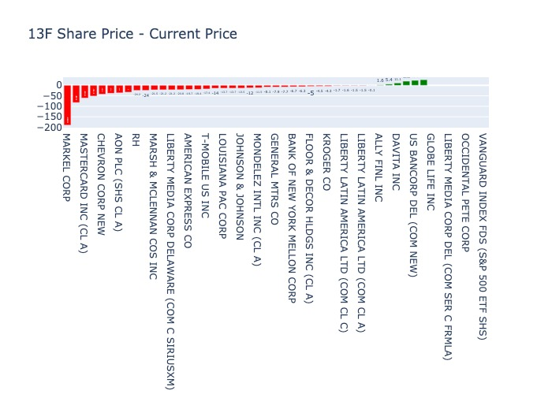
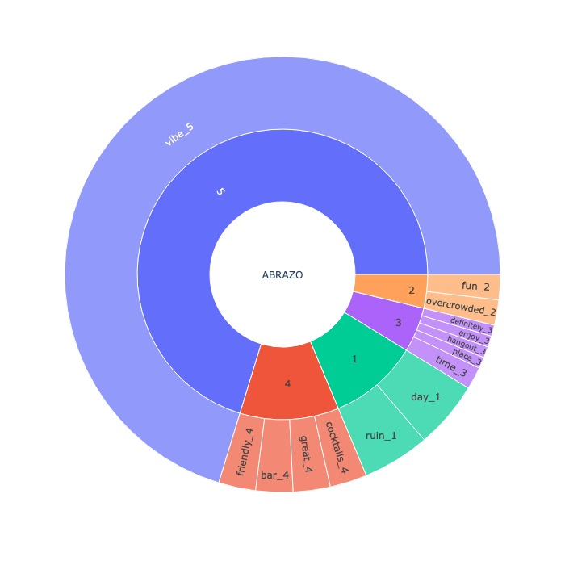
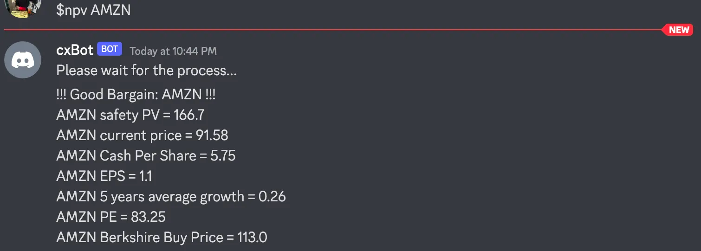

# Discord bot as a self-assistant of financial and customer anaylsis

## A fully functional discord bot project written in Python providing interactive assistant on the domain of finance and customer satisfaction.

- Create a connection between on-premise server and discord server
- Create an interactive discord bot for financial, customer analyses and others: 
  - Visualizing 13F Report of the selected investment manager (Warren Buffett's 13F below) 
  - Visualizing NLP analysis of google review: The text in the center is the name of restaurant. 5 stars rating is associated with high frequency of words in the outer ring.
  - Tracking on-sale items in the supermarket 

## Read through how discord bot helps myself analyze Amazon equity on Medium!
https://medium.com/@anfangen/amazon-valuation-analysis-b35c428e48b2

## How to install this discord bot project

1. Clone this project
2. Create virtual environment and install requirements.txt - 
   `virtualenv --no-site-packages --distribute .env &&\
    source .env/bin/activate &&\
    pip install -r requirements.txt`
3. Setup your discord bot connection and properties - see the link here - https://discord.com/developers/docs/introv=k0L_yR30PqI&list=PLSvCAHoiHC_rqKbcu1ummWVpLTDBNZHH7&index=5
4. Execute project `python bot_main.py`

## How to tweak this project for your own uses

I'd encourage you to clone and rename this project to use for your own puposes. It's a good starter to build up your bot assistant

## Known issues (Work in progress)

Due to difficulty of maintenance for web scraping on google reviews, the NLP analysis is pending for a while. 

## Like this project?

If you are feeling generous, please click star button and feel free to drop some messages.